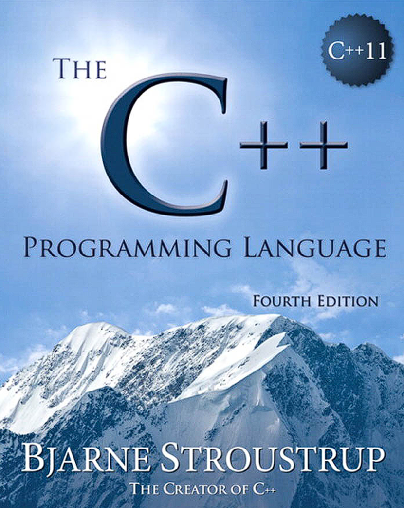
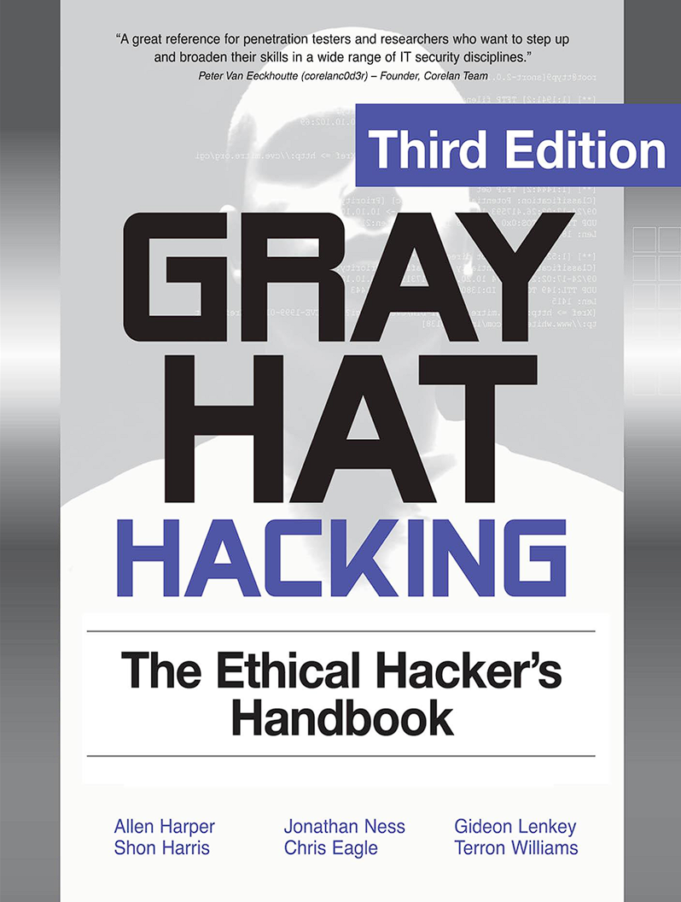

# 📚 Books of Knowledge
Resources related for Aptitude, Critical Learning, Programming Languages, etc.

## 🔢 1. Aptitude & Logical Reasoning

**Topics**: Quantitative aptitude, puzzles, logical reasoning, numerical ability, data interpretation

**Books**:
- *Quantitative Aptitude* by R.S. Aggarwal
- *A Modern Approach to Logical Reasoning* by R.S. Aggarwal
- *How to Prepare for Quantitative Aptitude* by Arun Sharma

**Practice Tools**:

---

## 🧠 2. Critical Thinking & Problem Solving

**Topics**: Logical fallacies, cognitive biases, decision making, analysis skills

**Books**:
- *Thinking, Fast and Slow* by Daniel Kahneman
- *The Art of Thinking Clearly* by Rolf Dobelli
- *How to Read a Book* by Mortimer Adler

**Resources**:

---

## 💸 3. Personal Finance & How to Make Money

**Topics**: Wealth building, investing, budgeting, passive income, freelancing

**Books**:
- *Rich Dad Poor Dad* by Robert Kiyosaki
- *The Millionaire Fastlane* by MJ DeMarco
- *I Will Teach You To Be Rich* by Ramit Sethi

**Tools**:

---

## 🌱 4. Life Skills & Productivity

**Topics**: Time management, habits, mental health, communication, self-discipline

**Books**:
- *Atomic Habits* by James Clear
- *Deep Work* by Cal Newport
- *The 7 Habits of Highly Effective People* by Stephen R. Covey

**Resources**:

---

## 💻 5. Programming Languages & Software Development

**Languages**: Python, JavaScript, C++, Java, Go, Rust, SQL

**Books**:
- *Python Crash Course* by Eric Matthes
- *Eloquent JavaScript* by Marijn Haverbeke
- *The C++ Programming Language* by Bjarne Stroustrup

**Tools**:

**Resources**:

---

## 📐 6. Mathematics & Statistics

**Topics**: Algebra, calculus, probability, statistics, number theory

**Books**:
- *Mathematics: A Very Short Introduction* by Timothy Gowers
- *The Art of Statistics* by David Spiegelhalter
- *Introduction to Probability* by Joseph K. Blitzstein

**Tools**:

---

## 🤖 7. Artificial Intelligence & Data Science

**Topics**: Machine learning, deep learning, data analysis

**Books**:
- *Hands-On Machine Learning with Scikit-Learn, Keras & TensorFlow* by Aurélien Géron
- *Python for Data Analysis* by Wes McKinney
- *Deep Learning* by Ian Goodfellow

**Tools**:

**Courses**:

---

## 📜 8. Philosophy, Ethics, and Human Understanding

**Books**:
- *Sophie’s World* by Jostein Gaarder
- *Meditations* by Marcus Aurelius
- *The Republic* by Plato

**Resources**:

---

 

>[!important]
>### ✹ Additional and important PDFs 
>
If you are seeing (Unable to render code block) warning than just download the pdf.

<table>
  <tr>
    <td align="center">
       
      
    </td>
    <td align="center">
       
      
    </td>
  </tr>
</table>

<table>
  <tr>
    <td align="center" width="50%">
       
      
    </td>
    <td align="center" width="50%">
       
      
    </td>
  </tr>
</table>

<table>
  <tr>
    <td align="center" width="50%">
       
      
    </td>
    <td align="center" width="50%">
       
      
    </td>
  </tr>
</table>

<table>
  <tr>
    <td align="center" width="50%">
       
      
    </td>
    <td align="center" width="50%">
       
      
    </td>
  </tr>
</table>

<table>
  <tr>
    <td align="center" width="50%">
       
      
    </td>
    <td align="center" width="50%">
       
      
    </td>
  </tr>
</table>

<table>
  <tr>
    <td align="center" width="50%">
       
      
    </td>
    <td align="center" width="50%">
       
      
    </td>
  </tr>
</table>

<table>
  <tr>
    <td align="center" width="50%">
       
      
    </td>
    <td align="center" width="50%">
       
      
    </td>
  </tr>
</table>

<table>
  <tr>
    <td align="center" width="50%">
       
      
    </td>
    <td align="center" width="50%">
       
      
    </td>
  </tr>
</table>

<table>
  <tr>
    <td align="center" width="50%">
       
      
    </td>
    <td align="center" width="50%">
       
      
    </td>
  </tr>
</table>

<table>
  <tr>
    <td align="center" width="50%">
       
      
    </td>
    <td align="center" width="50%">
       
      
    </td>
  </tr>
</table>

<table>
  <tr>
    <td align="center" width="50%">
       
      
    </td>
    <td align="center" width="50%">
       
      
    </td>
  </tr>
</table>

<table>
  <tr>
    <td align="center" width="50%">
       
      
    </td>
    <td align="center" width="50%">
       
      
    </td>
  </tr>
</table>

<table>
  <tr>
    <td align="center" width="50%">
       
      
    </td>
    <td align="center" width="50%">
       
      
    </td>
  </tr>
</table>

<table>
  <tr>
    <td align="center" width="50%">
       
      
    </td>
    <td align="center" width="50%">
       
      
    </td>
  </tr>
</table>

---

   ⚠️ This repository is uniquely designed by @JoshuaThadi

